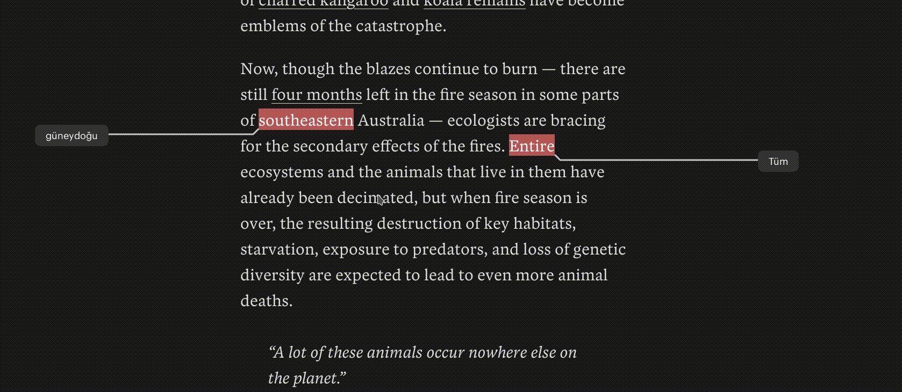

### açıklama

_bascevir_, seçilen kelime/cümle için çeviri yapan bir eklentidir. Yabancı bir dilde okuma yaparken anlamadığınız bir cümle veya kelimeyi CTRL tuşuna basarak seçerseniz kelimenin _google translate_ çevirisini küçük bir baloncukta gösterecektir.

### örnek kullanım

### kullanım tavsiyeleri

Bir çok site üzerinde sağlıklı çalışıyor fakat en ideal kullanım için [Pocket](https://getpocket.com) üzerinde kullanılmasını tavsiye ediyorum.

> Dil öğrenenler için: eklentiyi çeviri aracı olarak değil yazının bağlamından kopmamak için yardımcı bir araç olarak kullanın. Bir çok kelime için çeviri karşılığı doğru olmayabilir. Kelime öğrenmek için mutlaka sözlükten anlamına bakınız.

### uyarı

Bu eklenti herhangi bir anahtar gerektirmeyen _google translate single api_ kullanmaktadır. Kurulum için herhangi bir tanımlama yapmanız gerekmez. Kullanım esnasında arka arkaya sık çeviri yapmamalısınız, aksi halde _google_ tarafından bu api için bir kaç saatliğine engellenebilirsiniz.

### eklenti bağlantıları

[bascevir – 🦊 Firefox](https://addons.mozilla.org/en-US/firefox/addon/bascevir/)

### yapılacaklar

- [ ] [Kişiselleştirilmiş çevrimiçi sözlükler](https://github.com/selmansamet/bascevir/issues/2)
- [ ] Birden fazla cevap dönmesi için kullanıcının kendi Google API anahtarı tanımlayabilmesi

### katkı için

Karşılaştığınız bir hatayı [issue açarak](https://github.com/selmansamet/bascevir/issues/new) bildirebilirsiniz 💃
